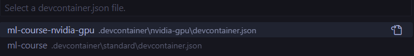

This repository is a Machine Learning course focusing on Deep Neural Networks. It is built up of a series of Jupyter notebooks that allow for an interactive environment, where code is split into cells that can be run individually. More can be read on https://jupyter.org/. 

## Course structure
The course consists of multiple parts, as indicated by the folders, where each contains a set of Jupyter Notebooks. In every part, there is a main notebook that is meant to be run first, before you explore the bonus notebooks. 

## Running the course
The course is intended to be run locally. This is definitely recommended if you have a NVIDIA GPU installed on your machine. However, the networks trained in this course are limited in size such that any modern CPU should be sufficient. If this is not practicable, the course can be run through the cloud service, Google Colab. The downside with this approach is that for every notebook, dependencies must be reinstalled and changes performed are only preserved if the notebooks are saved on Google Drive. 

### Running locally
When running locally, it is advisable not to have multiple notebooks open simultaneously. Although a notebook is not currently being viewed, but has been active, model weights and other states will be stored in memory. 

#### Alternative 1 - Jupyter Notebook in the browser (Docker)  **Recommended**
Make sure your Docker Daemon is running, then run the build command:
```bash
docker build -t ml-course .
```
This will install PyTorch and other necessary libraries in a Python environment.

Run the container with:
```
docker run -p 8888:8888 ml-course
```
**Note**: If you have a NVIDIA GPU installed, use `--gpus all` to allow the container access to your GPU. The run command then becomes `docker run -p 8888:8888 --gpus all ml-course`

The next steps are:
- Follow the instructions that appear in the terminal output. Multiple browser links pointing to a locally-hosted Jupyter interface should show up. Open the one starting with `http://127.0.0.1:8888/tree...`.
- In the browser, choose any of the notebooks from the project structure. 

#### Alternative 2: Jupyter Notebook in VSCode (Docker devcontainer)
The repository contains the necessary configuration files for running a dev-container in VSCode. Start by installing the [Dev Containers](https://marketplace.visualstudio.com/items?itemName=ms-vscode-remote.remote-containers) extension, and make sure that Docker Daemon is running. After that, open this repository in a new window. VSCode will then prompt you with the ability to open the project in a devcontainer:


If the above does not automatically present itself, open the command palette and run `Dev Containers: Rebuild and Reopen in Container`.  
Select between the two `devcontainer.json` files:



**By standard, you should choose `ml-course`**. If you have a NVIDIA GPU installed, select `ml-course-nvidia-gpu`.

### Running in the cloud (Google Colab)
If your computer does not have a dedicated graphics card installed, but you want to test the code with a GPU, you can run it through Google Colab. You need a Google account for this, but the service is free at restricted performance. 

Unfortunately, Google Colab does not easily allow for opening a project with multiple notebooks. Each of them must instead be opened individually. 
Below are links to the notebooks organized by parts.

- Part 1 - Tensors
    - Main: [Introduction to tensors](https://colab.research.google.com/github/willdalh/ml-course/blob/main/part1-tensors/tensors.ipynb)
    - Bonus: [Tensor indexing](https://colab.research.google.com/github/willdalh/ml-course/blob/main/part1-tensors/bonus_indexing.ipynb)

- Part 2 - Neural Networks
    - Main: [Neural Networks](https://colab.research.google.com/github/willdalh/ml-course/blob/main/part2-neural-networks/neural_networks.ipynb)
    - Bonus
        - [Convolutional Neural Networks](https://colab.research.google.com/github/willdalh/ml-course/blob/main/part2-neural-networks/bonus_convnet.ipynb)
        - [Gradients](https://colab.research.google.com/github/willdalh/ml-course/blob/main/part2-neural-networks/bonus_gradients.ipynb)
        - [Autoencoder](https://colab.research.google.com/github/willdalh/ml-course/blob/main/part2-neural-networks/bonus_autoencoder.ipynb)

- Part 3 - Natural Language Processing (NLP)
    - Main: [NLP Overview](https://colab.research.google.com/github/willdalh/ml-course/blob/main/part3-nlp/nlp.ipynb)
    - Bonus
        - [Audio Transcription](https://colab.research.google.com/github/willdalh/ml-course/blob/main/part3-nlp/bonus_audio_transcription.ipynb)
        - [Recurrent Neural Network](https://colab.research.google.com/github/willdalh/ml-course/blob/main/part3-nlp/bonus_rnn.ipynb)

    
After opening any of the notebooks in Colab, you will have to manually modify the environment to activate a GPU. Follow the steps below.

- Select `Runtime` in the navigation bar.
- Click `Change Runtime type`.
- Select `T4 GPU` in the popup and click save.

The notebook will restart, and you can verify GPU access by running `torch.cuda.is_available()` in a code cell.

**Each notebook starts with a script that installs the necessary dependencies in a Google Colab environment. When the cell containing this script finishes, you must restart the runtime.** If you switch to a GPU runtime after the dependencies have been installed, you must install them again. 

## Instructions for running code cells:
- VSCode and Google Colab
    - Select a cell and click the ▶️ button located to the left of the cell.
- Jupyter Notebook in the browser
    - Select a cell and click the ▶️ button in the navigation menu at the top of the window.
- Shortcut for all mentioned above
    - Select a cell and press `CTRL-Enter` (Windows) or `CMD-Enter` (Mac) to run the selected cell.